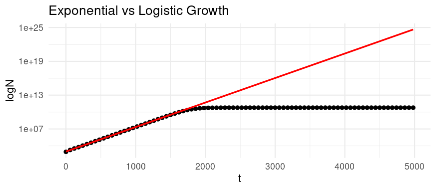

# Homework Answers 

## Background/Methods

In this practical, I analysed the `experiment.csv` file, which contains data on the population size (N) of *E. coli* at different times (t).

* I plotted N against t and then log(N) against t (in `plot_data.R`) to linearize the exponential growth phase.
* A linear model was fitted to estimate the growth parameters (N0, r, k) using a linear approximation (in `fit_linear_model.R`).

  - **Case 1: Early Growth Phase**  
    When t is small, N0 is much smaller than the carrying capacity (K). I filtered the data for t < 1500, where bacteria clearly exhibit exponential growth. N was log transformed to linearise the growth so I could use linear regression to estimate log(N0) (intercept) and r (slope). N0 was then obtained by doing e to the power of the intercept.

  - **Case 2: Stabilization at Carrying Capacity**  
    When t is large the population approaches the carrying capacity (K) and an asymptote is reached. I filtered the data for the range t>2500 where this plateau is reached and fit a linear model, where the intercept represents the carrying capacity (K)

* The model’s fit to the data was assessed visually (in `plot_data_and_model.R`), where it appeared to be a very good fit.

## Results 

The initial population size of *E. coli* was approximately 987, with an intrinsic growth rate (r) of around 0.01 and a carrying capacity (K) of around 60 billion.
| Parameter  | Estimated Value |
| ------------- | ------------- |
|N0 (initial population size of bacteria at time 0)|986.50747|
|r (intrinsic growth rate)|0.0100086|
|K (carrying capacity)|6.00e+10|

*Parameter Estimates Based on 'experiment.csv' Data*

Under logistic growth, the population size at 4980 mins would be 60,000,000,000 as carrying capacity is reached.
If exponential growth continued without constraints of carrying capacity, the population would reach 3.4e+24 (N = 986.50747(1+0.01000806)^4980 = 3.40252411e+24).

Exponential growth leads to 5.7e+13 times more bacteria!

*Figure showing exponential (red line) vs logistic (black line) growth*

