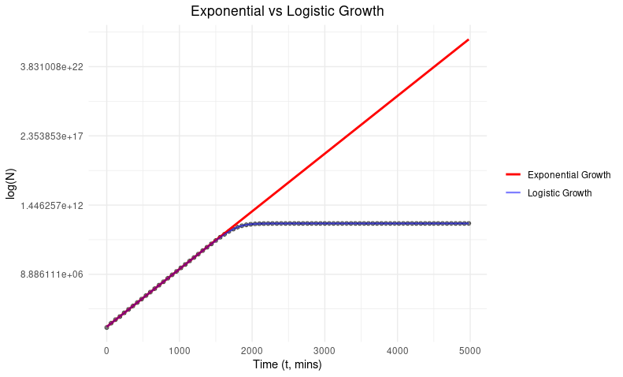

# Homework Answers 

## Question 1 - Background/Methods

In this practical, I analysed the `experiment.csv` file, which contains data on the population size (N) of *E. coli* at different times (t).

* I plotted N against t and then log(N) against t (in `plot_data.R`) to linearise the exponential growth phase

  *NOTE:  I changed the code in `plot_data.R` to graph the natural log instead of log10 as it made more sense with the use of the natural log later on with the linear model*.
* A linear model was fitted to estimate the growth parameters (N0, r, k) using a linear approximation (in `fit_linear_model.R`).

  - **Case 1: Early Growth Phase**  
    When t is small, N0 is much smaller than the carrying capacity (K). I filtered the data for t < 1500, where bacteria clearly exhibit exponential growth. N was log transformed to linearise the growth so I could use linear regression to estimate log(N0) (intercept) and r (slope). N0 was then obtained by doing e to the power of the intercept.

  - **Case 2: Stabilization at Carrying Capacity**  
    When t is large the population approaches the carrying capacity (K) and an asymptote is reached. I filtered the data for the range t>2500 where this plateau is reached and fit a linear model, where the intercept represents the carrying capacity (K).

* The model’s fit to the data was assessed visually (in `plot_data_and_model.R`), where it appeared to be a very good fit. The estimate of N0 is also close to the actual value of 879 from the actual data.

## Question 1 - Results 

The initial population size of *E. coli* was approximately 987, with an intrinsic growth rate (r) of around 0.01 and a carrying capacity (K) of around 60 billion.
This tells us the population is grows by around 1% per minute until the population size hits around 60 billion bacteria.

| Parameter  | Estimated Value |
| ------------- | ------------- |
|N0 (initial population size of bacteria at time 0)|986.50747|
|r (intrinsic growth rate)|0.0100086|
|K (carrying capacity)|6.00e+10|

*Parameter Estimates Based on 'experiment.csv' Data*

## Question 2 - Effect of Exponential vs Logistic Growth on Bacterial Population Size
- **Exponential Growth**:
  If exponential growth continued without constraints of carrying capacity, the population would reach **3.4e+24** bacteria at 4980 minutes (N = 986.50747(1+0.01000806)^4980 = 3.40252411e+24).

- **Logistic Growth**:
  Whereas, under logistic growth, the population size at 4980 minutes would only be **60,000,000,000** (6.0e+10) as carrying capacity is reached.

-> Exponential growth leads to **5.7e+13** times more bacteria!

## Question 3 - Graphing Exponential vs Logistic Growth 

In `plot_exponential_vs_logistic.R`, I make a figure to visually compare logistic vs exponential growth of these bacteria, which you can see below.

*Figure comparing exponential and logistic growth*.

